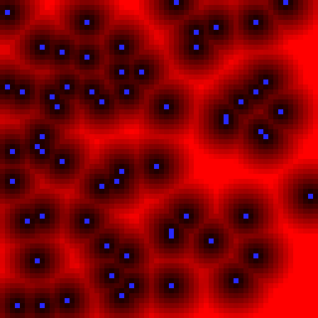

# VoronoiMap2D

Multithread implementation of the 2D exact Euclidean distance transform algorithm and Voronoi map extraction on the discrete grid (pure c++ with only [OpenMP](openmp.org)).

For more a more generic implementation (arbitrary dimensions, various metrics, Power diagram, medial axis, toroidal domains...), please have a look to [DGtal](dgtal.org).

This project comes alongside with the [lecture note](https://perso.liris.cnrs.fr/david.coeurjolly/courses/voronoimap2d/) (WIP)

**Note:** The exported SVG files may not be valid but fine for inkscape for instance.

| Input   | Output Voronoi map | Output distance transformation |
| ------------- | ------------- | ----------- |
| |  | |
